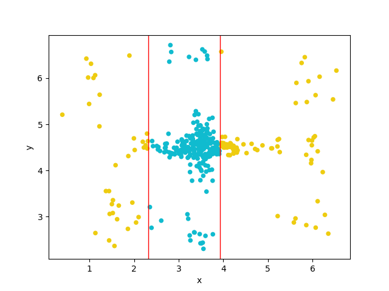
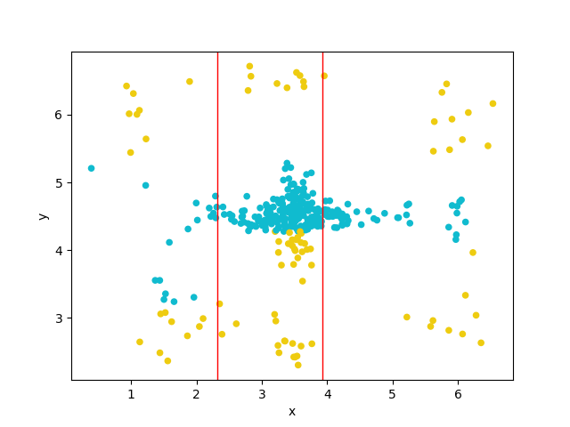

## 3-Evaluation de l'arbre artificiel

###### Feuille de Decision

    
    Exactitude: 0.7818181818181819
    Exactitude ponderee: 0.74975
    Précision: 0.5392156862745098
    Rappel: 0.6875
---

###### Arbre de décision:

    Exactitude: 0.8393939393939394
    Exactitude ponderee: 0.8005
    Précision: 0.651685393258427
    Rappel: 0.725

----

#### Commentaires

Les résultats se sont bien améliorés de la première évaluation avec un **arbre réduit** à une feuille, 
avec un rappel de `0.76 `, le modèle **arbre artificiel** a réussi a bien détecter les (in/out)liere à 80%. 
